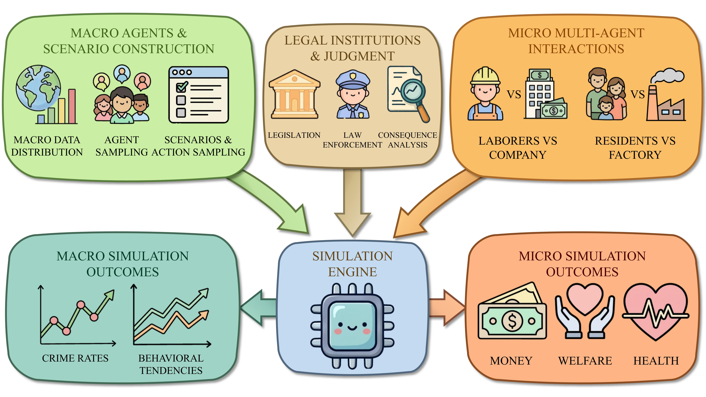

# Law in Silico: Simulating Legal Society with LLM-Based Agents
[](https://arxiv.org/abs/2510.24442)
[](https://aclanthology.org/2026.findings-acl.396/)



## Repository at a glance

| Path | Role |
| --- | --- |
| `legal_simulation/auto_main.py` | Micro labor/company command-line entrypoint. |
| `legal_simulation/main.py` | Labor/company micro simulation bootstrap. |
| `legal_simulation/simulation.py` | Labor/company micro simulation runtime. |
| `legal_simulation/config.py` | Labor/company micro configuration. |
| `legal_simulation/auto_main_pollution.py` | Micro pollution command-line entrypoint. |
| `legal_simulation/simulation_pollution.py` | Pollution micro simulation runtime. |
| `legal_simulation/config_pollution.py` | Pollution micro configuration. |
| `legal_simulation/macro_simulation/main.py` | Generic macro simulation runner. |
| `legal_simulation/macro_simulation/run_theft_baseline.py` | Specialized macro theft baseline experiment. |
| `legal_simulation/macro_simulation/scenes/` | Macro-format scene files. |
| `legal_simulation/utils/micro_macro_bridge.py` | Optional Micro-Macro Bridge API. |
| `tests/` | No-network release smoke tests. |
| `requirements.txt` | Dependencies for the smoke path and non-vLLM components. |

## Three code paths

### Micro simulation

The micro path is for small-agent, multi-step interaction. It is not a macro-style one-shot multiple-choice workflow.

The active micro path currently covers two active micro scene families, not exactly two fixed micro scenes:

- Labor/company
- Pollution/factory-resident

Each micro family may have sub-scene or hyperparameter variants.

#### Labor/company

Entrypoint:

```bash
cd legal_simulation && python auto_main.py --WHICH_EXP basic_exp --has-judge --COURT_BIAS neutral --LABOR_TRUST_LAWS not_available --DETERRENCE_OF_LAWS not_available
```

Code path:

- `legal_simulation/auto_main.py`
- `legal_simulation/main.py`
- `legal_simulation/simulation.py`

Configuration:

- `legal_simulation/config.py`

Agents:

- `Company`
- `Laborer`

Decision format:

- Open-ended / XML-style action response, for example `<response><think><action>...`
- Not multiple-choice

This is a real-LLM entrypoint. It requires environment configuration and should not be treated as a no-network smoke command.

#### Pollution/factory-resident

Entrypoint:

```bash
cd legal_simulation && python auto_main_pollution.py --EXP_NAME pollution_exp_001
```

Code path:

- `legal_simulation/auto_main_pollution.py`
- `legal_simulation/simulation_pollution.py`

Configuration:

- `legal_simulation/config_pollution.py`

Agents:

- `Factory`
- `Resident`

Decision format:

- Flat JSON action response with `action`, `param`, and `reason`
- Not multiple-choice

This is also a real-LLM entrypoint. It requires environment configuration and should not be treated as a no-network smoke command.

#### Micro Experiment Matrix

Active micro readiness currently covers two scene families: labor/company and pollution/factory-resident. Paper-intended families and conditions are experiment design labels; this matrix lists selected core runtime defaults and CLI knobs used by readiness checks, not the full runtime surface.

| Family | Runtime defaults | Runtime knobs |
| --- | --- | --- |
| Labor/company | `NUM_LABORERS=3`, `SIMULATION_MONTHS=4`, `NUM_ACTIONS_PER_MONTH=2`, `SEED=42`, `DETERRENCE_OF_LAWS=high`, empty `INITIAL_LAW_CODES` | `HAS_JUDGE` via `--has-judge` / `--no-judge`, `--COURT_BIAS`, `--LABOR_TRUST_LAWS`, `--DETERRENCE_OF_LAWS` |
| Pollution/factory-resident | `NUM_RESIDENTS=3`, `SIMULATION_MONTHS=7`, `NUM_ACTIONS_PER_MONTH=2`, `TEMPERATURE=1`, `INITIAL_FACTORY_CASH=20000.0`, `INITIAL_RESIDENT_CASH=800.0`, `BASE_REVENUE=14000.0` per turn | `--NUM_RESIDENTS`, `--SIMULATION_MONTHS`, `--NUM_ACTIONS_PER_MONTH`, `--INITIAL_FACTORY_CASH`, `--INITIAL_RESIDENT_CASH`, `--BASE_REVENUE`, `--TEMPERATURE` |

Labor/company scale defaults such as laborer count, months, actions per month, seed, and initial law codes are config/in-process settings only; they are not exposed by `auto_main.py` CLI. The labor/company runtime default includes `DETERRENCE_OF_LAWS=high`; neutral/no-deterrence baseline commands must override it with `--DETERRENCE_OF_LAWS not_available`. Labor bias or trust variants must set `DETERRENCE_OF_LAWS=not_available` unless the run is testing deterrence itself, because the prompt configuration rejects combining deterrence variants with bias/trust variants.

Pollution `NUM_ACTIONS_PER_MONTH` can be changed through `auto_main_pollution.py`, but several derived per-turn constants are computed when `config_pollution.py` is imported. Keep the default for calibrated runs and lightweight smokes unless the code is updated to recompute those derived constants after CLI overrides.

### Macro simulation

Macro simulation is an independent many-agent, single-step decision workflow. It is not the natural required continuation of micro. It does not require the bridge for all runs.

Generic macro entrypoint:

```bash
cd legal_simulation/macro_simulation && python main.py --scene_path scenes/theft.json --output_path ../../outputs/macro_results.json --model_path <local-vllm-model>
```

Optional law-code mode can add a macro scene law-code file, for example:

```bash
--law_codes_path scenes/micro_to_macro/scene_1/law_codes/laws_middle.json
```

Macro code path:

- `legal_simulation/macro_simulation/main.py`

Macro scene files include:

- `legal_simulation/macro_simulation/scenes/theft.json`
- `legal_simulation/macro_simulation/scenes/assault.json`
- `legal_simulation/macro_simulation/scenes/sexual.json`
- `legal_simulation/macro_simulation/scenes/micro_to_macro/scene_1/*`
- `legal_simulation/macro_simulation/scenes/micro_to_macro/scene_2/*`

The `macro_simulation/scenes/micro_to_macro/*` files are macro-format scenes for bridge-related experiments. They are not the active micro simulators.

Real macro runs require vLLM, GPU access, and a local model setup. `requirements.txt` does not install vLLM.

#### Macro theft baseline

The theft baseline is a specialized theft experiment, not the generic macro runner.

Entrypoint:

```bash
cd legal_simulation/macro_simulation && python run_theft_baseline.py --model_path <local-vllm-model> --output_dir ../outputs/theft_baseline
```

### Micro-Macro Bridge

The Micro-Macro Bridge is a utility/API component for scale-transfer or mapping experiments. It is optional and lightly integrated. It is not the main micro runtime, and it is not the main macro runtime.

Bridge API:

- `legal_simulation/utils/micro_macro_bridge.py::MicroMacroBridge`

Known methods:

- `export_micro_simulation`
- `create_macro_scene_from_micro`
- `load_micro_export`
- `apply_micro_laws_to_macro`

There is no committed bridge CLI. Do not treat bridge use as required for ordinary macro runs.

## Entrypoints table

| Code path | Entrypoint | Runtime expectation |
| --- | --- | --- |
| Micro labor/company | `cd legal_simulation && python auto_main.py --WHICH_EXP basic_exp --has-judge --COURT_BIAS neutral --LABOR_TRUST_LAWS not_available --DETERRENCE_OF_LAWS not_available` | Real LLM/API configuration required. |
| Micro pollution | `cd legal_simulation && python auto_main_pollution.py --EXP_NAME pollution_exp_001` | Real LLM/API configuration required. |
| Macro generic runner | `cd legal_simulation/macro_simulation && python main.py --scene_path scenes/theft.json --output_path ../../outputs/macro_results.json --model_path <local-vllm-model>` | Local vLLM/GPU/model setup required. |
| Macro theft baseline | `cd legal_simulation/macro_simulation && python run_theft_baseline.py --model_path <local-vllm-model> --output_dir ../outputs/theft_baseline` | Local vLLM/GPU/model setup required. |
| Bridge API | `legal_simulation/utils/micro_macro_bridge.py::MicroMacroBridge` | API-level utility only; no committed CLI. |

## Installation

Use a local Python environment and install the repository requirements:

```bash
pip install -r requirements.txt
```

The dependency file covers the release smoke path and non-vLLM repository components. Install and configure vLLM separately for macro runs that import `vllm`.

## Environment configuration

For real micro runs, copy `.env.example` to an untracked `.env` file and fill local values there. The micro LLM configuration keys are:

- `LAW_SIM_LLM_PROVIDER`
- `LAW_SIM_LLM_API_KEY`
- `LAW_SIM_LLM_BASE_URL`
- `LAW_SIM_LLM_MODEL`
- `LAW_SIM_LLM_MAX_TOKENS`
- `LAW_SIM_LLM_TIMEOUT`
- `LAW_SIM_GM_LLM_MODEL`
- `LAW_SIM_GM_LLM_TEMPERATURE`

Pollution and log output locations can be controlled with:

- `LAW_SIM_OUTPUT_DIR`
- `LAW_SIM_LOG_DIR`

Macro model configuration can use:

- `LAW_SIM_MACRO_MODEL_PATH`

Macro output locations are set by command-line arguments such as `--output_path` for the generic macro runner and `--output_dir` for the theft baseline.

Some older code paths may still read compatibility fallback variables named in `.env.example`. Keep all secrets, private endpoints, and real model paths in local untracked environment files only.

Set `LAW_SIM_LLM_MODE=mock` only for no-network smoke tests and constructors. Do not set it for real experiments.

## No-network smoke tests

Release smoke tests should run without real LLM, API, GPU, or vLLM access:

```bash
LAW_SIM_LLM_MODE=mock python -m pytest tests -q
```

This command validates the no-network release smoke path. It is not a real micro or macro experiment.

## Real LLM / vLLM run caveats

Real micro runs use the repository LLM interface and require local API-compatible LLM configuration.

Real macro runs import vLLM directly inside the macro runner and require a local model, GPU access, and vLLM installed outside `requirements.txt`.

The macro path accepts macro-format scenes directly. Bridge outputs and bridge-related scene files are optional inputs for selected mapping experiments, not required infrastructure for every macro run.

## Data and artifact policy

Keep generated outputs, logs, and local model or service configuration out of git. Use relative output locations such as `outputs/`, `Results/`, or `legal_simulation/logs/`.

Do not commit API keys, bearer tokens, passwords, private endpoints, real model paths, generated run artifacts, or machine-specific absolute paths.

## Limitations

- This README documents code-backed entrypoints and release checks only.
- Full paper reproduction has not been claimed here as validated.
- Micro labor/company and micro pollution runs require real LLM setup.
- Macro runs require separate vLLM/GPU/local model setup.
- The bridge is an optional API utility and has no committed CLI.
- The repository does not currently include a verified license file.

## Citation

If you find this repository useful, please cite our paper:

```bibtex
@inproceedings{wang-etal-2026-law,
    title = "Law in Silico: Simulating Legal Society with {LLM}-Based Agents",
    author = "Wang, Yiding  and
      Chen, Yuxuan  and
      Meng, Fanxu  and
      Chen, Xifan  and
      Yang, Xiaolei  and
      Zhang, Muhan",
    editor = "Liakata, Maria  and
      Moreira, Viviane P.  and
      Zhang, Jiajun  and
      Jurgens, David",
    booktitle = "Findings of the {A}ssociation for {C}omputational {L}inguistics: {ACL} 2026",
    month = jul,
    year = "2026",
    address = "San Diego, California, United States",
    publisher = "Association for Computational Linguistics",
    url = "https://aclanthology.org/2026.findings-acl.396/",
    doi = "10.18653/v1/2026.findings-acl.396",
    pages = "8061--8104",
    ISBN = "979-8-89176-395-1"
}
```
